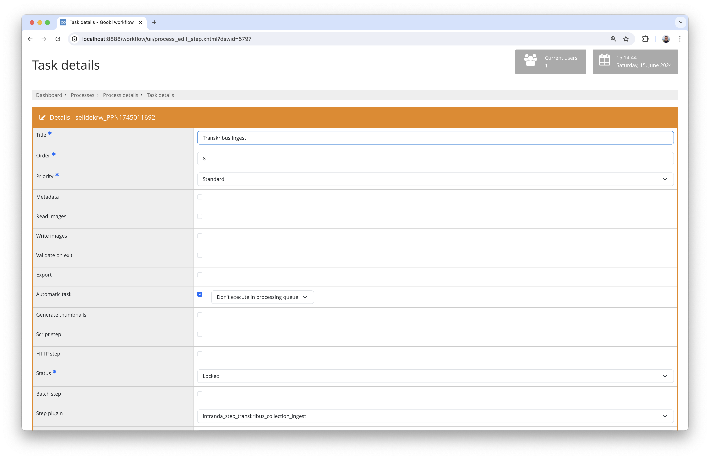

## Introduction
This documentation describes the installation, configuration and use of the Step plug-in for importing images into Transkribus Collections as well as the subsequent download of the annotated results as ALTO files.

## Installation
In order to use the plugin, the following files must be installed:

```bash
/opt/digiverso/goobi/plugins/GUI//opt/digiverso/goobi/plugins/step/plugin-step-transkribus-collection.jar
/opt/digiverso/goobi/config/plugin_intranda_step_transkribus_collection.xml
```

Once the plugin has been installed, it can be selected within the workflow for the respective work steps and thus executed automatically. A workflow could look like the following example:


To import the images into a Transkribus collection, the work must be imported into Transkribus via a publicly accessible METS file using the `intranda_step_transkribus_collection_ingest` plugin.



Once the work has been edited within Transkribus as desired, it can be downloaded again using the `intranda_step_transkribus_collection_download` plugin.


## Overview and functionality
This plugin imports the METS file into Transkribus and receives a document ID. This is saved in Goobi as a property with the name `Transkribus Document ID` for later download. 

Once the work has been processed in Transkribus, the download of the results from Transkribus can be initiated in a further step. To do this, the document ID from the property is used again and the data is saved within the ALTO directory in the `ocr` folder.


## Configuration
The plugin is configured in the file `plugin_intranda_step_transkribus_collection.xml` as shown here:

{{CONFIG_CONTENT}}

{{CONFIG_DESCRIPTION_PROJECT_STEP}}

Parameter               | Explanation
------------------------|-----------
`transkribusLogin`      | Enter the user name for Transkribus here.
`transkribusPassword`   | Enter the password for Transkribus here.
`transkribusApiUrl`     | Use the API URL from Transkribus here. This is usually `https://transkribus.eu/TrpServer/rest/`
`transkribusCollection` | Enter the ID of the Transkribus collection into which the documents are to be imported here.
`metsUrl`               | Define the URL to the METS file here. You can work with Goobi's variable system within the URL so that the URL is equipped with the correct parameters.
`ingestDelay`           | Specify a delay in milliseconds here that should be waited for the data to be ingested in order to then request the document ID from Transkribus.
`downloadDelay`         | Specify a delay in milliseconds here that should be waited after the export is triggered and the actual download.